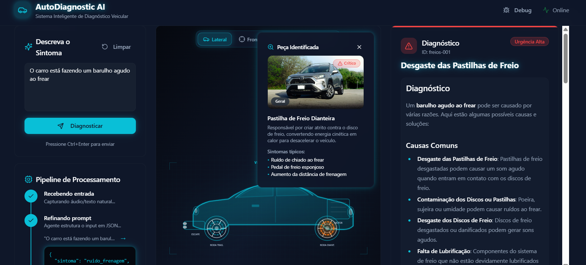
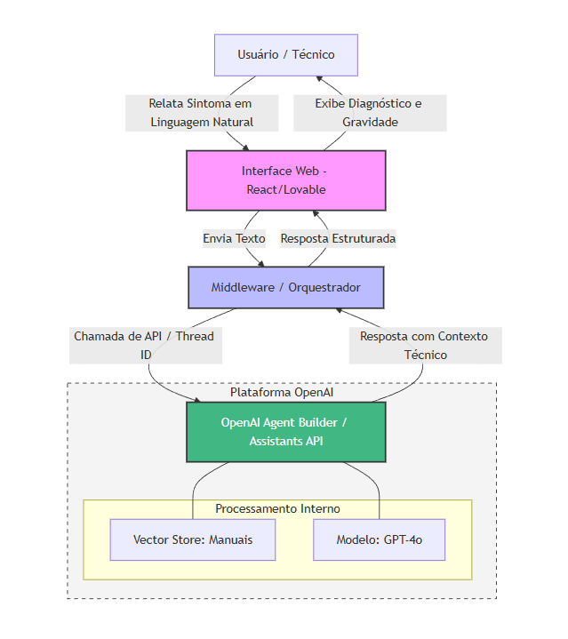

# AutoDiagnostic AI
#### Assistente de Diagnóstico de Falhas Veiculares por Linguagem Natural

Izaac Morais
Lucas de Carvalho
Thiago Nogueira
Tobias Oliveira

Prof: Filipe Calegário


---

# Resumo do projeto
- Aplicação web para diagnóstico veicular assistido por IA.
- Usuário descreve um sintoma em linguagem natural.
- Sistema retorna falha provável, urgência, zona afetada e ações recomendadas.
- O Sistema usa RAG para buscar informações em manuais de veículos.

---

# Funcionalidades
- Entrada de sintomas via linguagem natural.
- Agente de IA verifica o texto e a relevância para o objetivo do projeto.
- Resultado com urgência, peça e ação recomendada (cards).
- Uso de RAG para consultar dados no manual.
- Modo debug com testes rápidos.

---

# Tela do Projeto


---

# Ferramentas utilizadas (IA)
- Gemini 3 (requisitos e arquitetura)
- Lovable.dev (prototipação e geração inicial)
- OpenAI Assistants API (agente de IA)
- ChatGPT 5.2 (ajustes de Prompt)
- DeepSeek V3.2 (ajustes de Prompt)
- Codex (ajustes e documentação)

---

# Casos de teste

**Caminho Padrão**
- Entrada: "O carro está fazendo um barulho agudo ao frear"
- Demonstra o funcionamento completo: 
  - Input -> Processamento -> Diagnóstico RAG -> Visualização 3D -> Identificação da Peça.

---



---

# Casos de teste

**Tratamento de Erro - Falta de Informação**
- Entrada: string vazia / apenas espaços
- Validação de formulário impedindo envio de inputs vazios

---


---

# Prompts e outputs

**Prompt 1**
Atue como um arquiteto de soluções e gere um código Mermaid (graph TD) para um sistema de diagnóstico técnico baseado em IA. O diagrama deve seguir estes requisitos:

1. Fluxo de Dados: O Usuário envia sintomas para um Frontend (React/Lovable). O Frontend repassa para um Backend (Middleware), que por sua vez se comunica com a OpenAI Agent Builder/Assistants API.
...

--- 
# Prompts e outputs

**Output**

Arquitetura proposta




---

# Prompts e outputs

**Prompt 2**
```
altere o README para refletir o projeto atual, coloque os seguintes passos:

- resumo (o que é o projeto?)
- funcionalidades
- organização das pastas
- como um usuário consegue utilizar?
- como replicar o projeto?
```
---

# Prompts e outputs
**Output (resumo)**
```
# AutoDiagnostic AI

## Resumo (o que é o projeto?)
Aplicação web para diagnóstico veicular assistido por IA. O usuário
descreve um sintoma em linguagem natural e o sistema apresenta uma análise com provável falha, 
zona do veículo afetada e passos recomendados. 
Há integração com Supabase (Edge Function `diagnose`) 
e fallback local baseado em uma base de conhecimento embutida.
...
```

---

# Post-mortem

**1. o que funcionou bem no uso de IA?**
    - Geração de Prompt via LLM (para o Lovable por exemplo)
    - Uso do Lovable pra contexto geral (como inicio do sistema)
**2. o que não funcionou ou exigiu intervenção manual?**
    - A integração com o OpenAI Assistants API
    - Refinamento da interface e features mais complexas no Lovable
**3. quanto tempo estimam que economizaram (ou perderam)?**
    - Ganhamos por um lado e perdemos por outro lado
 
---

# Post-mortem

**4. o que fariam diferente se começassem de novo?**
    - Organização do projeto
**5. uma lição para levar para a vida profissional**
    - Utilizar ferramentas de IA sem o conhecimento prévio ou domínio do que ta sendo gerado torna a solução refém da prórpria IA e, ao invés de automatizar, qualquer ajuste pode ser um grande desafio.
    